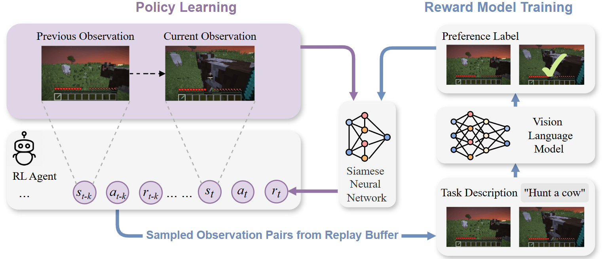
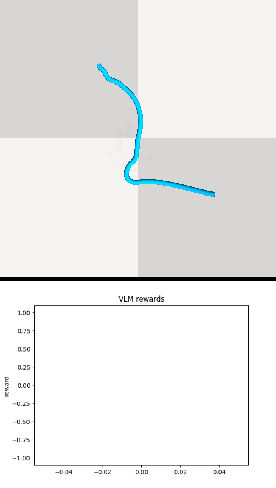

# VLM-R3L


## Demo
<p align="center">
  
  
  
  
  
</p>

<p align="center">
  
  
  
  
  <!--  -->
</p>
## Setup

Download [MineCLIP](https://drive.google.com/file/d/1uaZM1ZLBz2dZWcn85rZmjP7LV6Sg5PZW/view) and place the `attn.pth` file in this repository.

## Build the Docker Images
- ### minedojo
    ```sh
    cd minedojo/docker-minedojo
    docker build -t minedojo .
    ```

## Run task
```sh
xvfb-run python run.py --mode train --env minedojo --task combat_spider --algo ppo --reward_mode VLM-R3L --vlm phi3.5
```
