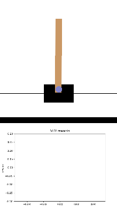
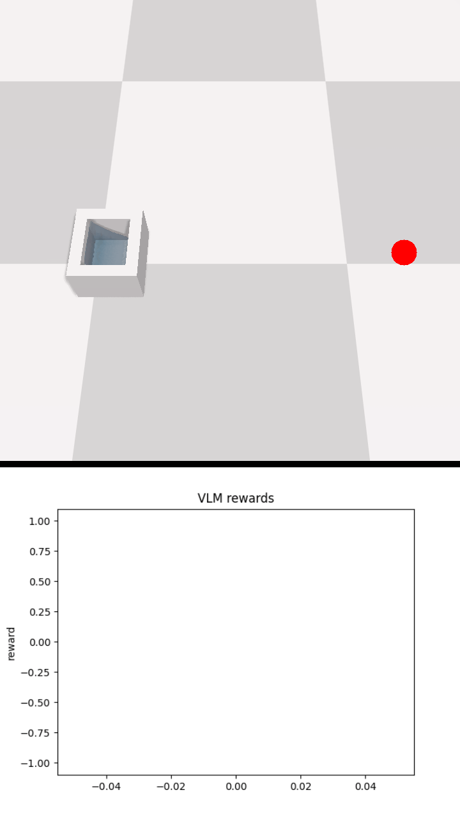
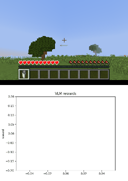
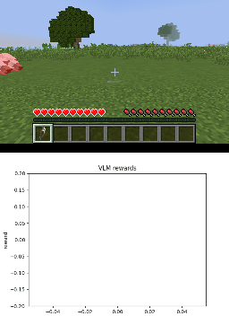

# VLM-AR3L


## Demo
<p align="center">
  
  
  
  
  
  
</p>

<p align="center">
  
  
  
  
</p>

## Setup

Download [MineCLIP](https://drive.google.com/file/d/1uaZM1ZLBz2dZWcn85rZmjP7LV6Sg5PZW/view) and place the `attn.pth` file in this repository.

## Build the Docker Images
- ### minedojo
  ```sh
  cd docker-minedojo
  docker build -t minedojo .
  ```
- ### gym & softgym & metaworld
  ```sh
  cd docker-metaworld
  docker build -t metaworld .
  ```

## Run task
| Environment | Tasks |
|---|---|
| gym | CartPole-v1, RingWorld |
| softgym | PassWater, RopeFlattenEasy |
| metaworld | drawer-open-v2, sweep-into-v2, soccer-v2 |
| minedojo | combat_spider, milk_cow, shear_sheep, hunt_cow |

> **Note**
> - `gym`, `softgym`, and `metaworld` currently support **SAC only**.
> - `minedojo` currently supports **PPO only**.

```sh
# gym
python run_sac.py task=CartPole-v1 --config-name gym
python run_sac.py task=RingWorld --config-name gym

# softgym
python run_sac.py task=PassWater --config-name softgym
python run_sac.py task=RopeFlattenEasy --config-name softgym

# metaworld
python run_sac.py task=drawer-open-v2 --config-name metaworld
python run_sac.py task=sweep-into-v2 --config-name metaworld
python run_sac.py task=soccer-v2 --config-name metaworld

# minedojo
python run_ppo.py task=combat_spider --config-name minedojo
python run_ppo.py task=milk_cow --config-name minedojo
python run_ppo.py task=shear_sheep --config-name minedojo
python run_ppo.py task=hunt_cow --config-name minedojo
```

## Eval VLM Reasoning

The evaluation data is stored under:

```text
VLM/data/{task}/{label}/{id}{0/1}.png
````

Example:

```text
VLM-AR3L/VLM/data/CartPole-v1/0/00.png
VLM-AR3L/VLM/data/CartPole-v1/0/01.png
```

where:

* `{task}` is the environment task name (e.g., `CartPole-v1`)
* `{label}` is the preference label
* `{id}` is the sample index
* `{0/1}` indicates the image in the preference pair

For each sample:

* `{id}0.png` corresponds to `image0`
* `{id}1.png` corresponds to `image1`

Each label directory contains 50 preference pairs.

Preference labels are defined as:

* `0`: `image0` is preferred
* `1`: `image1` is preferred